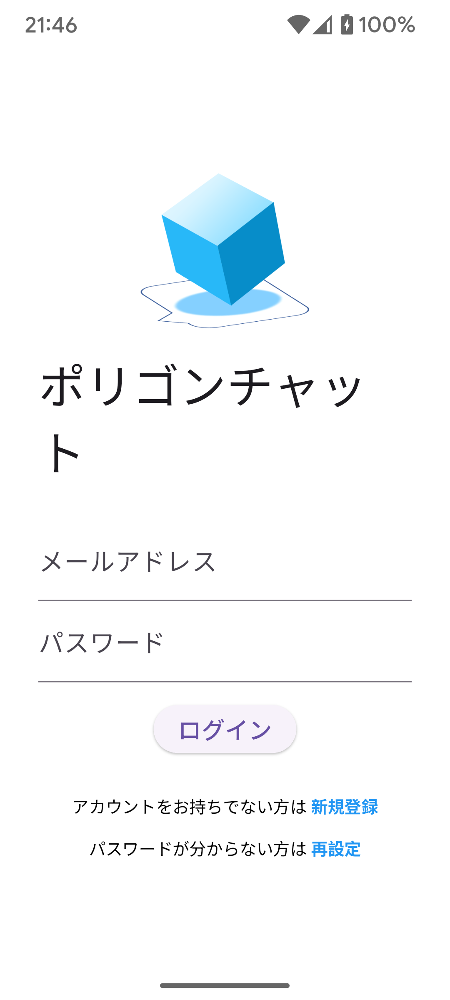
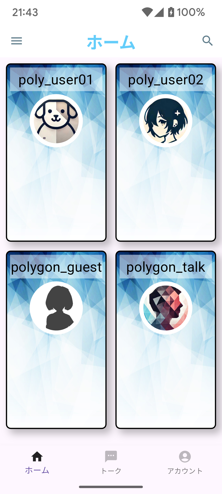
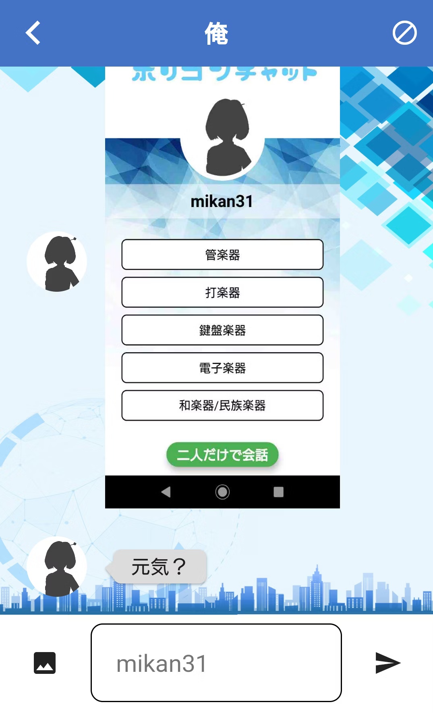

## 📱 App Screenshots

### 🔑 Login Screen


- Users enter their email and password to log in.
- Firebase Authentication handles authentication.
- New users can register via the sign-up option.
- Forgotten passwords can be reset via email.

### 🏠 Home Screen


- Displays a list of users based on shared interests.
- Users can search and filter profiles.
- Clicking a profile navigates to `UserDetail()`.

### 💬 Chat Screen


- Real-time messaging with Firebase Firestore.
- Users can send and receive messages.
- Supports text and image messages.


## 📂 Project Structure

```
├── lib/
│   ├── main.dart                               # Checks session data and starts the app
│   ├── user_login.dart                         # Handles Firebase Authentication login
│   ├── root.dart                               # Manages bottom navigation and notifications
│   ├── polygon_drawer.dart                     # Side menu (settings, contact, logout)
│   ├── create_profile.dart                     # Manages new user profile creation
│   ├── model.dart                              # Handles user input and Firebase Storage uploads
│   ├── reset_password.dart                     # Sends password reset emails via Firebase
│   │   ├── drawer/
│   │   │   ├── contact.dart                    # Contact page
│   │   │   ├── contract.dart                   # Terms & conditions
│   │   │   ├── privacy.dart                    # Privacy policy
│   │   │   ├── setting.dart                    # Settings page
│   │   ├── first_launch/
│   │   │   ├── first_view.dart                 # Displays Terms of Service and Privacy Policy for user agreement
│   │   ├── paira/
│   │   │   ├── paira.dart                      # AI-like assistant interface
│   │   │   ├── paira_model.dart                # AI assistant logic and state management
│   │   ├── routes/
│   │   │   ├── bubble.dart                     # Chat message bubbles
│   │   │   ├── chat.dart                       # Main chat screen
│   │   │   ├── chatroom.dart                   # Individual chat rooms
│   │   │   ├── account/
│   │   │   │   ├── account.dart                # User profile page
│   │   │   │   ├── header_choice.dart          # User header image selection
│   │   │   │   ├── hobby_menu.dart             # Hobby selection menu
│   │   │   │   ├── hobby_menu_next.dart        # Next step in hobby selection
│   │   │   │   ├── image_choice.dart           # User profile image selection
│   │   │   ├── home/
│   │   │   │   ├── common_list.dart            # Shows users with similar interests
│   │   │   │   ├── home.dart                   # Main home screen
│   │   │   │   ├── tab_info.dart               # Manages home screen tabs
│   │   │   │   ├── user_list.dart              # User list in home screen
│   │   │   │   ├── home_grid/
│   │   │   │   │   ├── comment.dart            # User comment section
│   │   │   │   │   ├── home_tile.dart          # Tile UI for displaying users
│   │   │   │   │   ├── image_circle.dart       # Circular profile images
│   │   │   │   │   ├── title_text.dart         # UI component for text titles
│   │   │   │   ├── user_detail/
│   │   │   │   │   ├── user_detail.dart        # Full user profile screen
│   │   │   │   │   ├── user_header.dart        # Displays header images
│   │   │   │   │   ├── user_hobby.dart         # User hobbies display
│   │   │   │   │   ├── user_image.dart         # Profile images
│   │   │   │   │   ├── user_name.dart          # Displays user names
│   │   │   │   │   ├── user_name_comment.dart  # User name with comments
```


## 📦 Installation
1. Clone the repository:
   ```sh
   git clone https://github.com/gaze11a/Polygon-chat.git
   ```
2. Install dependencies:
   ```sh
   flutter pub get
   ```
3. Run the app:
   ```sh
   flutter run
   ```
