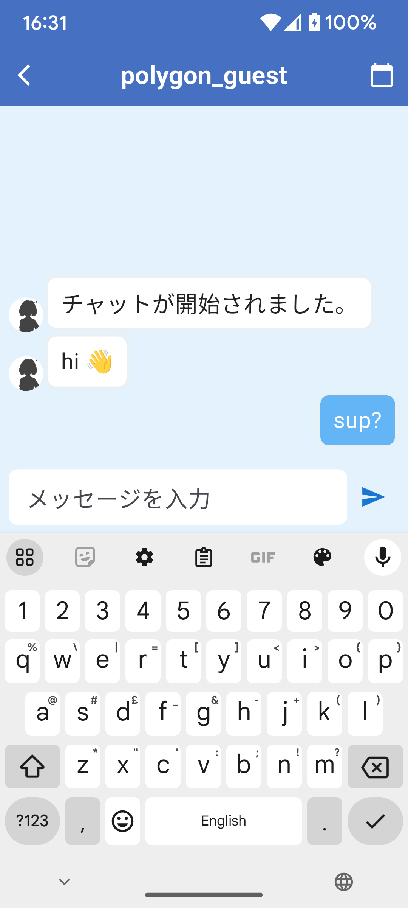

## 📱 App Screenshots

### 🔑 Login Screen


- Users enter their email and password to log in.
- Firebase Authentication handles authentication.
- New users can register via the sign-up option.
- Forgotten passwords can be reset via email.

### 🏠 Home Screen


- Displays a list of users based on shared interests.
- Users can search and filter profiles.
- Clicking a profile navigates to `UserDetail()`.

### 💬 Chat Screen


- Real-time messaging with Firebase Firestore.
- Users can send and receive messages.
- Supports text and image messages.


## 📂 Project Structure

```
lib/
│  main.dart                           # Checks session data and starts the app
│  root.dart                           # Manages bottom navigation and notifications
│  
├─fonts/
│  
├─login/
│      create_profile.dart             # Manages new user profile creation
│      first_view.dart                 # Displays Terms of Service and Privacy Policy
│      reset_password.dart             # Sends password reset emails via Firebase
│      user_login.dart                 # Handles Firebase Authentication login
│      
└─routes/
    ├─account/
    │      account.dart                # User profile page
    │      
    ├─chat/
    │      bubble.dart                 # Chat message bubbles
    │      chat.dart                   # Main chat screen
    │      chatroom.dart               # Individual chat rooms
    │      
    ├─home/
    │  │  home.dart                   # Main home screen
    │  │  polygon_drawer.dart         # Side menu (settings, contact, logout)
    │  │  tab_info.dart               # Manages home screen tabs
    │  │  user_list.dart              # User list in home screen
    │  │  
    │  ├─drawer/
    │  │      contact.dart            # Contact page
    │  │      contract.dart           # Terms & conditions
    │  │      privacy.dart            # Privacy policy
    │  │      setting.dart            # Settings page
    │  │      
    │  ├─user_detail/
    │  │      user_detail.dart        # Full user profile screen
    │  │      user_header.dart        # Displays header images
    │  │      user_image.dart         # Profile images
    │  │      user_name.dart          # Displays user names
    │  │      user_name_comment.dart  # User name with comments
    │  │      
    │  └─user_tile/
    │          comment.dart            # User comment section
    │          home_tile.dart          # Tile UI for displaying users
    │          image_circle.dart       # Circular profile images
    │          title_text.dart         # UI component for text titles
    │          
    └─utils/
            image_choice.dart           # User profile image selection
            loading_dialog.dart         # Shows loading dialog during async operations
            model.dart                  # Handles user input and Firebase Storage uploads
```


## 📦 Installation
1. Clone the repository:
   ```sh
   git clone https://github.com/gaze11a/Polygon-chat.git
   ```
2. Install dependencies:
   ```sh
   flutter pub get
   ```
3. Run the app:
   ```sh
   flutter run
   ```
